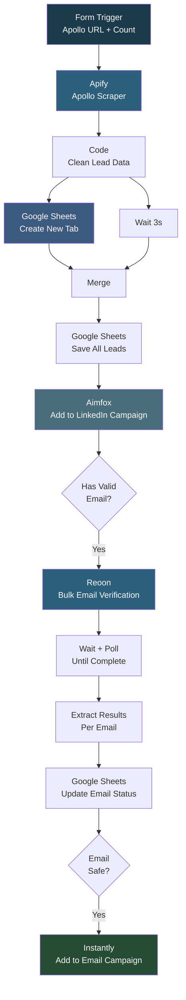

# Leah Scrapper (Don't Edit)

## Overview

This workflow is a complete lead generation pipeline that scrapes contacts from Apollo, saves them to a dynamically created Google Sheet, adds each lead to an Aimfox LinkedIn campaign, verifies all email addresses in bulk using Reoon, and then pushes verified leads to an Instantly email campaign. It handles the entire flow from raw Apollo URL to multi-channel outreach-ready leads with verified emails, all triggered from a simple form.

## How It Works

```
Form (Apollo URL + lead count) -> Apify Apollo Scraper -> Clean data -> Create new Google Sheet tab -> Save leads to sheet -> Add each lead to Aimfox campaign -> Collect emails -> Reoon bulk email verification -> Poll until complete -> Extract verification results -> Update sheet with email status -> Filter "safe" emails -> Add to Instantly campaign
```

### Workflow Diagram



## Integrations

- **Apify** - Apollo.io lead scraping
- **Google Sheets** - Dynamic sheet creation and lead storage
- **Aimfox** - LinkedIn outreach campaign
- **Reoon** - Bulk email verification
- **Instantly** - Email outreach campaign

## Setup

1. Import `Leah_Scrapper_DONt_EDIT_.json` into your n8n instance.
2. Configure Google Sheets OAuth2 credentials.
3. Update the Apify API token in the HTTP Request node.
4. Update the Aimfox bearer token and campaign ID.
5. Update the Reoon API key for email verification.
6. Update the Instantly bearer token and campaign ID.
7. Update the Google Sheet document ID for the output spreadsheet.
8. Activate the workflow and submit the form with an Apollo URL.
